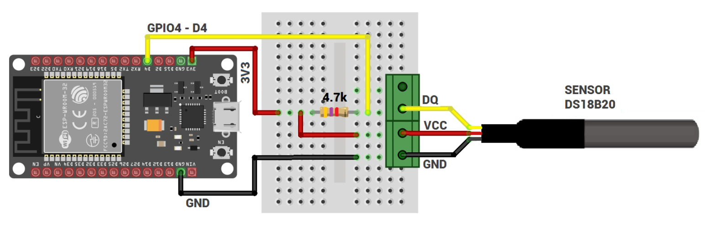

# Sistema de Monitoreo de Temperatura en Tiempo Real (IoT)

Este proyecto es una solución integral de monitoreo térmico que combina una aplicación móvil Android y un sistema embebido basado en MicroPython. El sistema permite la lectura, visualización gráfica, almacenamiento de historial y alertas sonoras automatizadas basadas en umbrales de temperatura.

## Características Principales

- **Monitoreo Multisensor:** Soporte para múltiples sensores DS18B20 conectados a un nodo ESP.
- **Servidor TCP Integrado:** La aplicación Android actúa como un servidor socket de alto rendimiento que recibe datos en tiempo real.
- **Gráficas en Vivo:** Visualización dinámica de la temperatura promedio utilizando la librería `MPAndroidChart`.
- **Sistema de Alertas:** Activación automática de una alarma sonora cuando la temperatura promedio supera los 32°C.
- **Historial Persistente:** Almacenamiento local de lecturas en formato JSON para consulta posterior, incluso después de cerrar la app.
- **Interfaz Intuitiva:** Gestión de conexión del servidor (Iniciar/Detener) y lista detallada de sensores activos.

## Arquitectura del Sistema

El proyecto se divide en dos componentes principales que se comunican a través de una red Wi-Fi local:

1.  **Nodo Sensor (MicroPython):** 
    *   Lee datos de sensores DS18B20.
    *   Se conecta como cliente TCP a la IP del dispositivo Android.
    *   Envía ráfagas de datos cada 5 segundos.
2.  **App de Control (Android/Java):**
    *   Escucha peticiones en el puerto `8080`.
    *   Procesa las cadenas de texto recibidas y las convierte en datos numéricos.
    *   Calcula promedios y gestiona la lógica de negocio (alertas y gráficas).
    *   Guarda el registro con timestamp para auditoría futura en JSON.

## Requisitos

### Hardware
- Microcontrolador compatible con MicroPython (ESP32 / ESP8266).
- Sensores de temperatura DS18B20.
- Smartphone con Android 7.0 (Nougat) o superior.
- Red Wi-Fi compartida para ambos dispositivos.

### Software
- **Android Studio** (para compilar la aplicación móvil).
- **Thonny** o **uPyCraft** (para flashear el script de MicroPython al ESP).

## Configuración e Instalación

### 1. Preparación del ESP
Edita el archivo `sensor_modo servidorESP TecNM.py`:
```python
SSID = "Tu_Nombre_WiFi"
SERVER_IP = "192.168.1.XX"  # La IP que muestra tu celular en la App
SERVER_PORT = 8080
```

### 2. Instalación de la App
1. Abre la carpeta `Aplicacion7` en Android Studio.
2. Compila y genera el APK o instala directamente en tu dispositivo.
3. Asegúrate de conceder permisos de red si el sistema lo solicita.

## Funcionamiento (Demostración)

> **Video de demostración:**
> He grabado un video detallado explicando el funcionamiento de la interfaz, la conexión entre el sensor y la app, y las pruebas de activación de la alarma de temperatura.
> 
> [Ver video de demostración aquí](https://tgutierrez-my.sharepoint.com/personal/l21270656_tuxtla_tecnm_mx/_layouts/15/stream.aspx?id=%2Fpersonal%2Fl21270656%5Ftuxtla%5Ftecnm%5Fmx%2FDocuments%2FIm%C3%A1genes%2FSistema%20de%20monitoreo%20de%20temperatura%20mediante%20aplicaci%C3%B3n%20m%C3%B3vil%2Emp4&nav=eyJyZWZlcnJhbEluZm8iOnsicmVmZXJyYWxBcHAiOiJTdHJlYW1XZWJBcHAiLCJyZWZlcnJhbFZpZXciOiJTaGFyZURpYWxvZy1MaW5rIiwicmVmZXJyYWxBcHBQbGF0Zm9ybSI6IldlYiIsInJlZmVycmFsTW9kZSI6InZpZXcifX0&ga=1&referrer=StreamWebApp%2EWeb&referrerScenario=AddressBarCopied%2Eview%2Ecb30cd1f%2D3427%2D4eac%2D88f3%2D803732aef87d)

## Diagrama del circuito (ESP32)



## Estructura del Código

### 1. Componente Android (Java)
**Ubicación:** `Aplicacion7/app/src/main/java/com/example/aplicacion7/`

#### `MainActivity.java` (Controlador Maestro)
- **Servidor Multihilo:** Implementa un `ServerSocket` en un hilo secundario para evitar el bloqueo de la interfaz de usuario (ANR - Application Not Responding).
- **Procesamiento de Protocolo:** Segmentación de tramas mediante el método `.split(":")` y análisis (parsing) de tipos de datos.
- **Lógica de Alerta:** Monitoreo del promedio de temperatura con activación automática mediante `MediaPlayer` al superar los 32°C.

#### `HistoryActivity.java` (Persistencia)
- **Gestión de archivos locales:** Almacenamiento en formato `JSON` (`temperature_history.json`).
- **Paso de objetos complejos:** Implementación de `Serializable` para transferir datos entre Activities.

#### `MessageAdapter.java`
- **Lista dinámica:** Orquestador del `RecyclerView` para mostrar el estado actualizado de los sensores en tiempo real.

---

### 2. Nodo Sensor (MicroPython)
**Archivo:** `sensor_modo servidorESP TecNM.py`

#### Bus 1-Wire
- **Escaneo automático:** Detección de direcciones hexadecimales (ROMs) de sensores DS18B20 conectados al Pin 4.

#### Gestión de Red
- **Conexión WiFi:** Función `connect_wifi` implementada con manejo de errores y sistema de reintentos.

#### Transmisión TCP
- **Serialización de datos:** Codificación en `UTF-8` para el envío de información.
- **Comunicación robusta:** Uso de sockets bloqueantes con control exhaustivo de excepciones.


## Tecnologías Utilizadas

- **Lenguajes:** Java (Android), Python (MicroPython).
- **Librerías Android:** 
  - `MPAndroidChart` (Visualización de datos).
  - `RecyclerView` (Listado de sensores y mensajes).
- **Protocolos:** TCP/IP Sockets.

---
*Desarrollado para el proyecto de monitoreo de temperatura - TecNM.*
